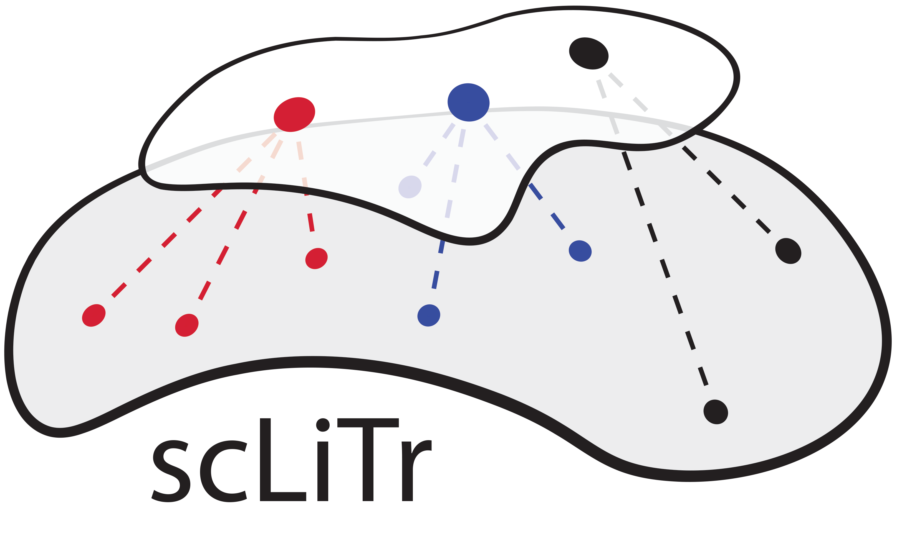

<p align="center"><a href="https://sclitr.readthedocs.io/en/latest/"></a></p>

# scLiTr

scLiTr is a Python package for analysis of lineage tracing coupled with single-cell RNA-Seq.

The main key of the package are clonal embeddings — vector representations of the whole clones
in low dimensional space (clone2vec). These representations is a dropout-robust and cluster-free
way of representation of heterogeneity within clonal behaviour for cell type tree-free hypothesis
generation regarding cells' multipotency.

clone2vec builds representation of clones in exact same way with popular word embedding algorithm — word2vec —
via construction two-layers fully connected neural network (it uses Skip-Gram architecture) that
aims to predict neighbour cells clonal labellings by clonal label of cells. As a result, clones that exist in
similar context in gene expression space will have similar weights in this neural network, and these weights
will be used as embedding for further analysis.

## Installation

scLiTr might be installed via `pip` (takes 1-2 minutes on Google Colab):
```bash
pip install sclitr
```
or the latest development version can be installed from GitHub using:
```bash
pip install git+https://github.com/kharchenkolab/scLiTr
```

## System requirements

`scLiTr` requires Python 3.8 or later with packages listed in [setup.cfg](setup.cfg) file. The package was successfully tested
on the following systems:

* macOS Sonoma 14.5 (Apple M1 Chip @ 3.20GHz × 8, 16GB RAM) — *MacBook Air M1*,
* Ubuntu 18.04.5 LTS, 64-bit (Intel Xeon @ 2.60GHz × 32, 256GB RAM) — *PowerEdge server*,
* Ubuntu 22.04.3 LTS, 64-bit (Intel Xeon @ 2.20GHz × 2, 13GB RAM) — *Google Colab*.

## Documentation and tutorials

Please visit [documentation web-site](https://sclitr.readthedocs.io/en/latest/) to check out API description and a few
tutorials with analysis.

An example with the dataset from [Weinreb et al., 2020](https://www.science.org/doi/10.1126/science.aaw3381) is available on
[Google Colab](https://colab.research.google.com/github/kharchenkolab/scLiTr/blob/main/docs/source/Basic_usage.ipynb)
(takes about 45 minutes on the CPU, of which approximately 30 minutes are clone2vec latent representation construction).

## clones2cells

For interactive exploration of clonal and gene expression embeddings together we recommend using
our simple tool [clones2cells](https://github.com/serjisa/clones2cells_app).
